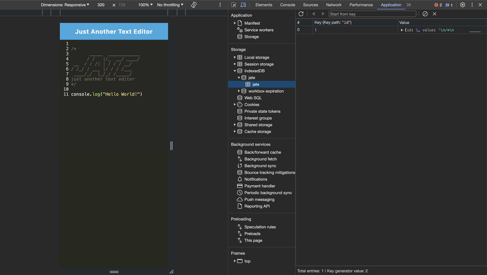

# Text Editor Starter Code

## Link to Deployed Application

<a href="https://text-editor-123-1328847b472b.herokuapp.com/">Text Editor</a>

## Description

- Progressive Web Application: JATE is a highly efficient text editor designed as a PWA.
- Full-Stack Deployment: Easily deployable on Heroku for widespread accessibility.
- Modern Web Technologies: Utilizes Webpack for bundling, Babel for JavaScript transpilation, and Workbox for service worker implementation.
- Online and Offline Functionality: IndexedDB integration ensures data persistence and reliability, whether online or offline.
- Desktop Version: Offers an installable desktop application for enhanced accessibility and convenience.
- User-Friendly Interface: Designed for both developers and general users, offering a seamless text editing experience.

## Usage

Access the editor through the browser at localhost:3000 after starting the server.
- Type and edit text or code snippets directly in the editor.
- The application auto-saves your work to IndexedDB, retaining data even after closing the browser.

Offline Functionality:
- JATE functions offline, allowing you to continue editing without an internet connection.

PWA Installation:
- Click the 'Install' button in the browser to download and install the desktop version of JATE.

Deployment:
- Follow the included Heroku deployment guide to deploy JATE to a live server.

## Installation

- Clone the repository to your local machine.
- Run npm install in the root directory to install all dependencies.
- Use npm run start:dev to start the development server.

## Screenshot of the Website

- Below are the screenshots of the app's main page, registered service worker, manifest.json file, and IndexedDB storage.

## Contribution

N/A

## Tests

N/A

## License

This project is covered under the [MIT](https://opensource.org/licenses/MIT) license.

## Questions

For any questions, please reach out to me at the following:

- [GitHub Profile](https://github.com/yega1009)
- Email: yega1009@gmail.com
